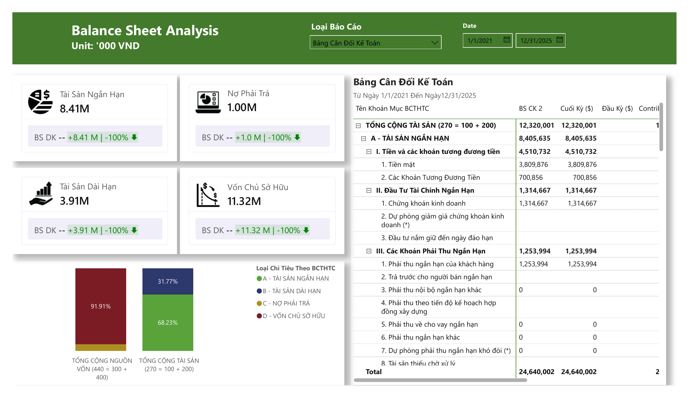
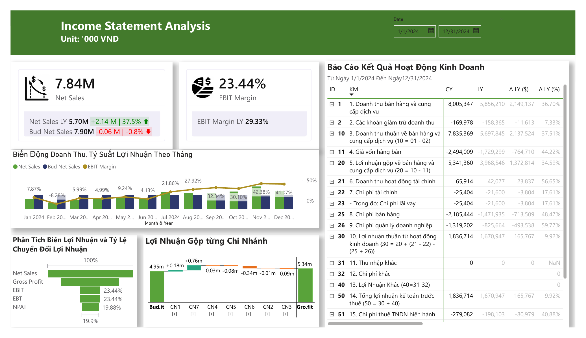
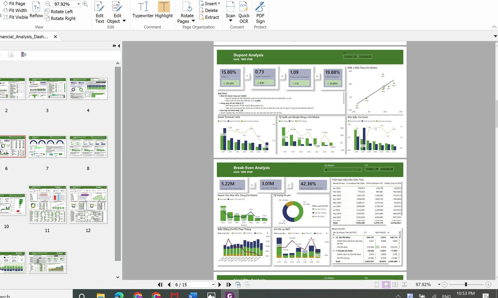
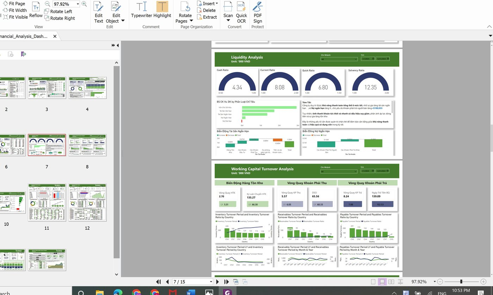
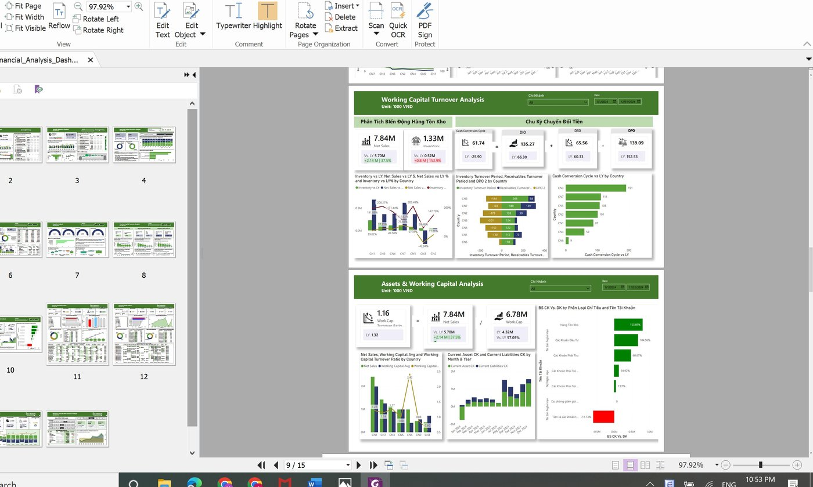
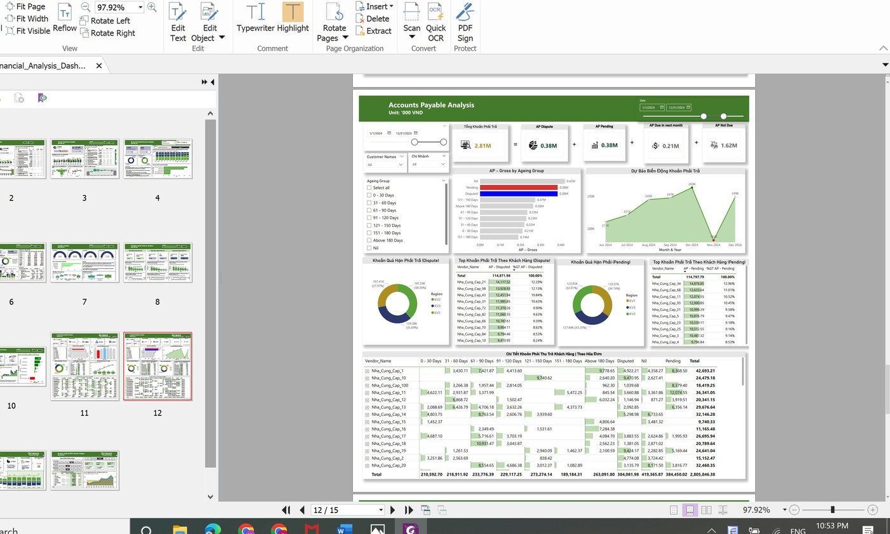

# 💰 Financial Analytics Dashboard

**Power BI | DAX | SQL | Financial Analysis**

A comprehensive 15-page financial analytics dashboard built in Power BI, covering end-to-end financial performance analysis for a multi-branch organization.

---

## 📊 Dashboard Overview

| Page | Description |
|------|-------------|
| 📋 Balance Sheet Analysis | Asset & capital structure with YoY comparison |
| 📈 Income Statement Analysis | Revenue, EBIT, NPAT with monthly trend |
| 🏢 Income Statement by Branch | Branch-level P&L and EBIT margin breakdown |
| 🏗️ Asset & Capital Structure | Current vs non-current asset analysis |
| 📐 DuPont Analysis | ROE decomposition: margin × turnover × leverage |
| ⚖️ Break-Even Analysis | Fixed/variable cost split and BEP by branch |
| 💧 Liquidity Analysis | Current ratio, quick ratio, cash ratio, solvency |
| 🔄 Working Capital Turnover | DIO, DSO, DPO and cash conversion cycle |
| 🏭 Assets & Working Capital | Working capital turnover by branch |
| 📥 Accounts Receivable (AR) | Ageing analysis, overdue tracking, AR forecast |
| 📤 Accounts Payable (AP) | AP ageing, dispute & pending management |
| 💵 Cash Flow Statement | CFO, CFI, CFF analysis by branch |
| 📅 Daily Cash Flow Analysis | Monthly inflow/outflow forecast |
| 📉 Revenue, COGS & OPEX Variance | Scenario analysis with adjustable assumptions |

---

## 🔑 Key Metrics (FY2024)

| Metric | Value | vs Last Year |
|--------|-------|-------------|
| Net Sales | **7.84M** | ▲ +37.5% |
| Gross Profit Margin | **68.17%** | — |
| EBIT | **1.84M** | — |
| EBIT Margin | **23.44%** | ▼ vs 29.33% LY |
| NPAT Margin | **19.88%** | — |
| D/E Ratio | **0.09** | Healthy |
| Current Ratio | **8.08** | Strong |
| Cash Conversion Cycle | **61.74 days** | ▲ vs -25.90 LY |

---

## 🛠️ Tools & Techniques

- **Power BI Desktop** — Report development & interactive visualizations
- **DAX** — Custom measures: YoY variance, margins, ratios, rolling totals
- **Power Query** — ETL, data transformation and modeling
- **Data Modeling** — Star schema, relationships, calculated tables
- **Financial Analysis** — DuPont, Break-Even, Ageing, Cash Flow modeling

---

## 📁 Files

| File | Description |
|------|-------------|
| `Financial_Analysis_Dashboard.pbix` | Power BI source file (interactive) |
| `Financial_Analysis_Dashboard_V2_3.pdf` | PDF export for preview |

---

## 📸 Dashboard Preview

### Balance Sheet Analysis

### Income Statement Analysis

### DuPont & Break-Even Analysis

### Liquidity & Working Capital

### Assets & Working Capital

### Accounts Payable Analysis

---

## 👩‍💻 About

Built by **Angela Nguyen Hao** — Data Scientist & BI Specialist

